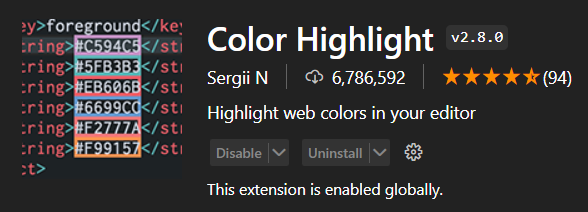

## Extenções Origamid Utilizadas.


---


---


---


---



# Anotações JavaScript

### Linguagem Interpretada.

- JavaScript é uma linguagem interpretada.

JavaScript é uma linguagem de programação amplamente utilizada para criar interatividade em páginas da web. Uma de suas características mais distintivas é que é uma linguagem interpretada. Isso significa que o código JavaScript é executado linha por linha pelos navegadores da web, sem a necessidade de compilação prévia.

Ao contrário de linguagens compiladas, como C++ ou Java, onde o código fonte é traduzido para código de máquina antes da execução, o JavaScript é interpretado diretamente pelos navegadores. Isso permite um desenvolvimento mais ágil, já que você pode fazer alterações no código e ver os resultados imediatamente sem a necessidade de recompilação.

Além disso, o JavaScript é uma linguagem versátil que pode ser usada tanto no lado do cliente (no navegador) quanto no lado do servidor (com Node.js), tornando-a uma escolha popular para o desenvolvimento web completo.

Seu modelo de execução assíncrono e não bloqueante também o torna adequado para lidar com operações de entrada/saída intensivas, como requisições de rede, sem interromper a execução de outras tarefas.

Em resumo, JavaScript é uma linguagem interpretada poderosa e flexível, fundamental para o desenvolvimento moderno de aplicações web interativas.

### Declaração de Variáveis em JavaScript

Em JavaScript, você pode declarar variáveis usando as palavras-chave `var`, `let` ou `const`.

- `var`: Era a forma tradicional de declarar variáveis em JavaScript, mas agora é menos utilizada. Variáveis declaradas com `var` têm escopo de função ou escopo global, dependendo de onde são declaradas.

- `let`: Introduzido no ECMAScript 6 (também conhecido como ES6), `let` permite que você declare variáveis com escopo de bloco. Isso significa que a variável só é acessível dentro do bloco onde foi declarada.

- `const`: Também introduzido no ECMAScript 6, `const` é usado para declarar constantes. O valor de uma constante não pode ser alterado depois de ser atribuído.

Exemplos:

```javascript
// Declarando variáveis com var
var nome = "João";
var idade = 30;

// Declarando variáveis com let
let produto = "Celular";
let preco = 1000;

// Declarando constantes com const
const PI = 3.14159;
const URL = "https://www.example.com";
```
